# Proyecto CouchDB - Mundial 2026

# Descripción General

Este proyecto tiene como objetivo transformar archivos en distintos formatos (`.html`, `.csv` y `.pdf`) hacia un único archivo `.json`, para posteriormente almacenar la información en una base de datos NoSQL utilizando Apache CouchDB y visualizarla mediante un frontend desarrollado con tecnologías web modernas.

---

# Paso a Paso del Proceso

# Pre Etapa: Instalación de Dependencias

Antes de ejecutar el proyecto, es necesario instalar las dependencias requeridas para el procesamiento y transformación de archivos.

Ejecutar el siguiente comando:

```bash
pip install -r requirements.txt
```

Este comando instala todas las librerías necesarias utilizadas por los scripts encargados de transformar archivos `.html`, `.csv` y `.pdf` hacia formato `.json`.

---

# Primera Etapa: Transformación de Archivos a JSON

En esta etapa se procesan diferentes tipos de archivos para convertir su contenido en estructuras JSON.

## 1. Conversión de `.html` a `.json`

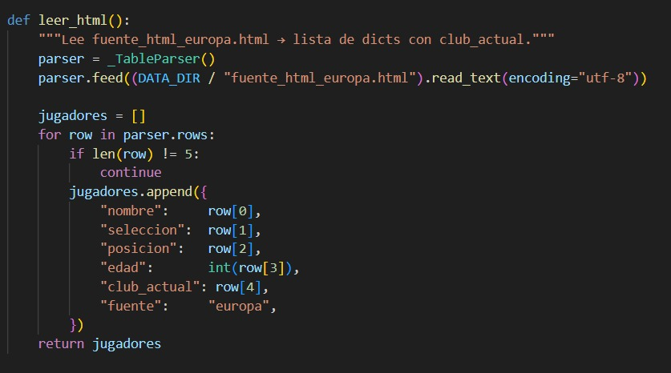

---

## 2. Conversión de `.csv` a `.json`

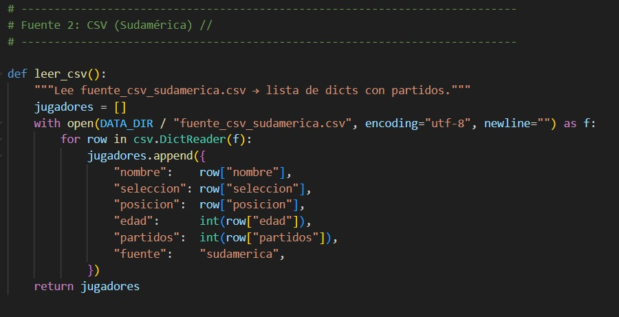

---

## 3. Conversión de `.pdf` a `.json`

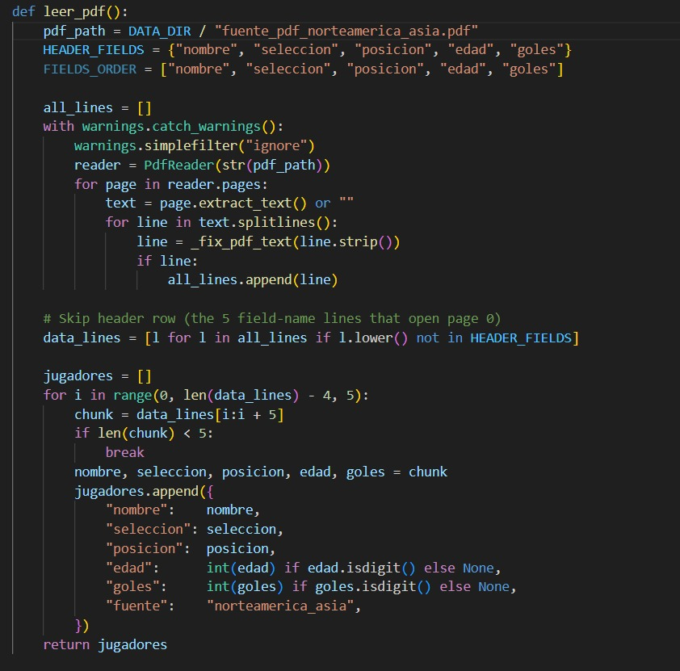

---

Todos estos procesos fueron integrados dentro de un único script de Python denominado:

```plaintext
generar_json.py
```

Este archivo ejecuta simultáneamente todos los procesos de conversión y generación de datos.

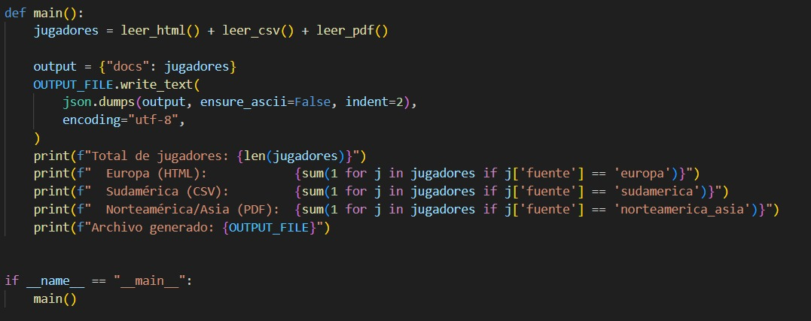

Una vez procesados todos los archivos, se genera el archivo final:

```plaintext
mundial_2026.json
```

El cual contiene toda la información estructurada y lista para ser almacenada en la base de datos.

---

# Segunda Etapa: Creación de la Base de Datos en CouchDB

NOTA: Deberia tener instalado Docker

## Configuración de entorno

Antes de levantar el contenedor, se creó un archivo `.env` con las credenciales de CouchDB: 
Se puede utilizar el comando cp .env.example .env en linux o el comando copy .env.example .env en windows

```env
COUCHDB_USER=admin
COUCHDB_PASSWORD=admin
COUCHDB_PORT=5984
```

También se configuró el archivo `docker-compose.yml` para levantar el servicio:

```yaml
services:
  couchdb:
    image: couchdb
    ports:
      - "5984:5984"

    environment:
      COUCHDB_USER: ${COUCHDB_USER}
      COUCHDB_PASSWORD: ${COUCHDB_PASSWORD}
```

---

## Levantar el contenedor de CouchDB

Para iniciar el servicio de CouchDB mediante Docker se ejecuta:

```bash
docker compose up -d
```

---

## Verificar el estado del contenedor

```bash
docker ps
```

Este comando permite verificar que el contenedor de CouchDB se encuentre funcionando correctamente.
Para la verificar apropiadamente la ejecucion acceda a esta direccion:
```bash
[docker ps](http://localhost:5985/_utils/#login)
```

## Creación de la base de datos

La base de datos se creó desde la interfaz web de CouchDB.

Nombre de la base de datos:

```plaintext
jugadores
```

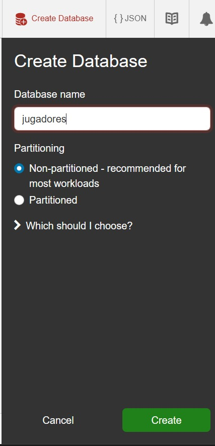

Aqui realizamos un revoke de permisos de roles para poder seguir adelante con la ejecucion:

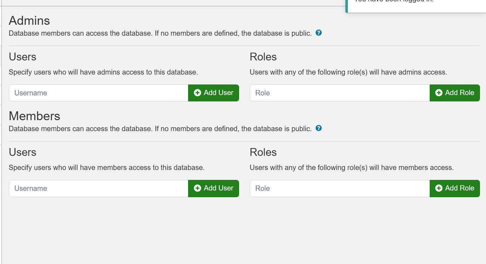

# Tercera Etapa: Carga de Datos a CouchDB

NOTA: ejecutar en cmd y no en powershell

Para importar el archivo JSON a la base de datos `jugadores` se utilizó el siguiente comando:

```bash
curl -u admin:admin \
-d @mundial_2026.json \
-H "Content-type: application/json" \
-X POST http://127.0.0.1:5984/jugadores/_bulk_docs
```
NOTA: El archivo cargar couch db puede realizar todo este proceso desde la creacion de la base la carga de datos y la creacion de vistas utilizando las credenciales que existen en el .env si no existe el .env se utilizan valores por defecto.
## Explicación del comando

- `@mundial_2026.json` → Archivo JSON que contiene la información.
- `127.0.0.1:5984` → Dirección y puerto donde se encuentra ejecutándose CouchDB.
- `jugadores` → Nombre de la base de datos creada previamente.
- `_bulk_docs` → Endpoint utilizado para insertar múltiples documentos de forma masiva.

Este proceso:

- Lee el archivo `mundial_2026.json`.
- Envía la información a CouchDB.
- Inserta todos los documentos en la base de datos `jugadores`.

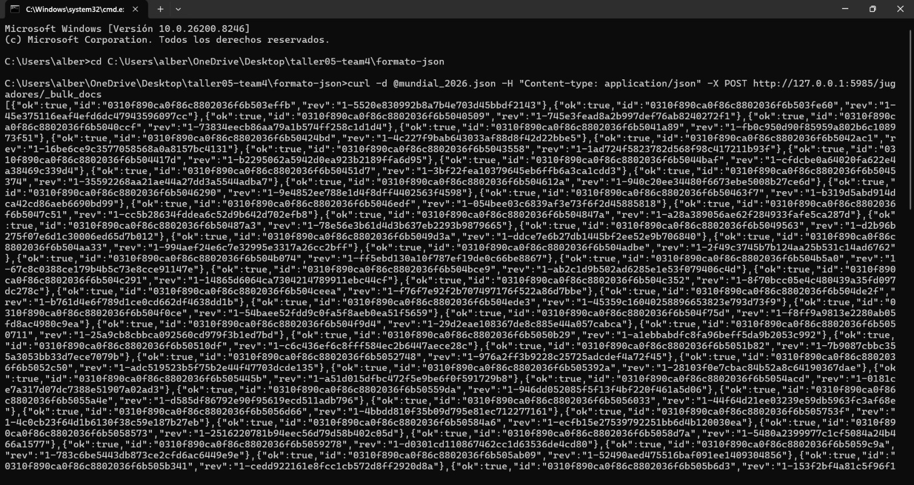

---

# Cuarta Etapa: Creación de Vistas

Dentro de CouchDB se crearon diferentes vistas para consultar la información almacenada.

## Procedimiento

1. Ingresar a la base de datos `jugadores`.
2. Abrir la sección `Design Documents`.
3. Crear un nuevo documento de diseño llamado:

```plaintext
losjugadores
```

---


## Vista por Club

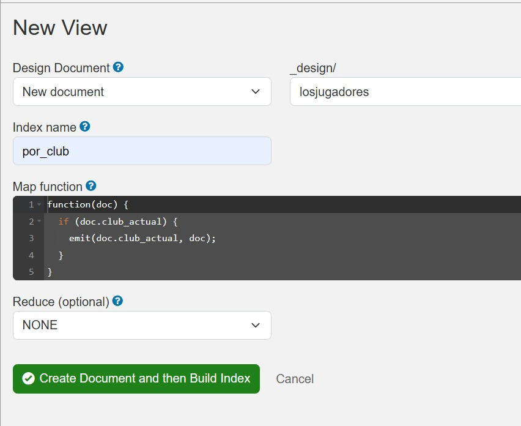

---

## Vista por Goles

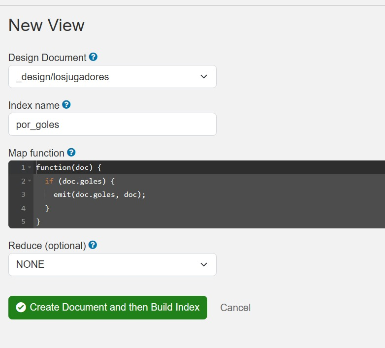

---

## Vista por Partidos

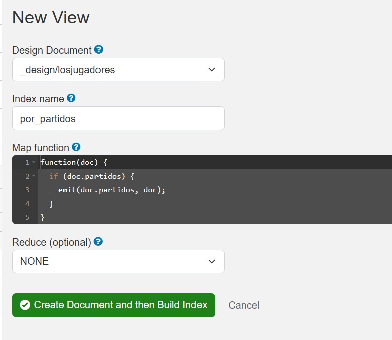

---

# Quinta Etapa: Ejecución del Frontend

Abrir una nueva terminal e ingresar a la carpeta del frontend:

```bash
cd frontend
```

---

## Instalación de dependencias

```bash
npm install
```

---

## Ejecución de la aplicación

```bash
npm run dev
```

Posteriormente abrir en el navegador la dirección mostrada en la terminal.

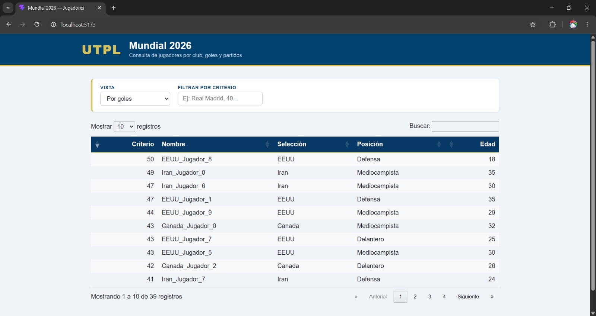

---
NOTA: En el archivo main.js revisar que la direccion url concuerde con el puerto que se esta ejecutando, esto puede causar error en la carga de datos

const BASE_URL = "http://localhost:5985/jugadores/_design/losjugadores/_view/";

# Personalización de la Interfaz

Durante el desarrollo del frontend se realizaron distintas personalizaciones visuales:

- Incorporación de títulos personalizados.
- Inclusión de pie de página.
- Uso de colores institucionales de la universidad.

## Paleta de colores utilizada

### Regal Blue (Primary)

```plaintext
HEX: #01416F
RGB: 1, 65, 111
CMYK: 99, 41, 0, 56
```

### Deep Sapphire (Accent)

```plaintext
HEX: #083866
RGB: 8, 56, 102
CMYK: 92, 45, 0, 60
```

### Tacha (Gold/Yellow)

```plaintext
HEX: #D4C05D
RGB: 212, 192, 93
CMYK: 50, 58, 60, 17
```

---

# Tecnologías Utilizadas

- Python
- JSON
- Docker
- Apache CouchDB
- JavaScript
- Node.js
- Vite
- HTML5
- CSS3

---

# Resultado Final

El proyecto permite:

- Transformar información desde múltiples formatos.
- Consolidar datos en archivos JSON.
- Almacenar información en CouchDB.
- Consultar datos mediante vistas.
- Visualizar la información desde una interfaz web personalizada.
